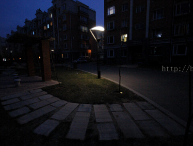
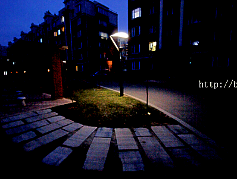

We provide a c++ version of low-light enhancement technology, which is helpful for vSLAM and line dect,etc.

Everyone can use it, and stars are necessary.

### Related Publications

* **[LIME](https://ieeexplore.ieee.org/document/7782813/)**, X. Guo, Y. Li and H. Ling, "LIME: Low-Light Image Enhancement via Illumination Map Estimation," in IEEE Transactions on Image Processing, vol. 26, no. 2, pp. 982-993, Feb. 2017.


### Example
  



# Preparation
Clone the code
```
git clone https://github.com/zj611/LIME_Processing.git
```
Then build the project 
```
cd LIME_Processing
mkdir build 
cd build 
cmake ..
make
```
run the project 
```
cd ../bin
./LIME
```

